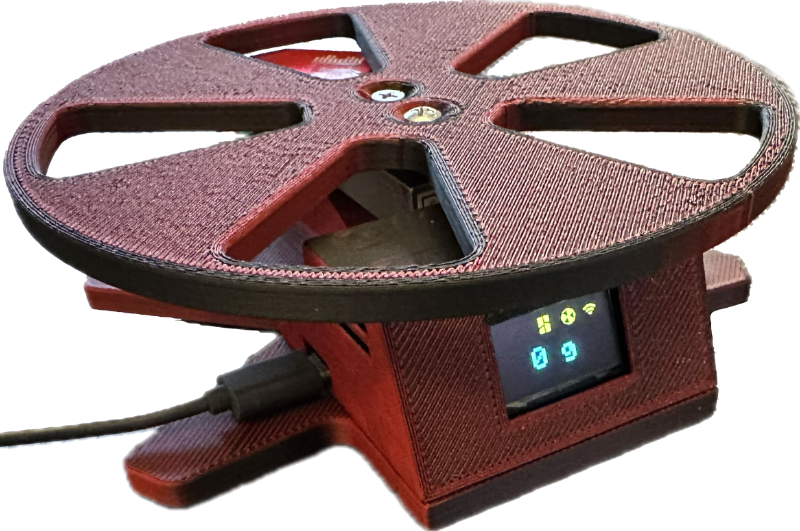
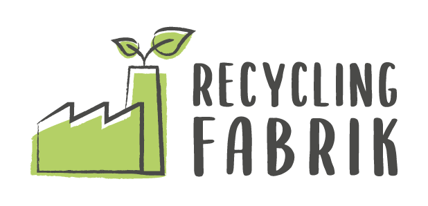
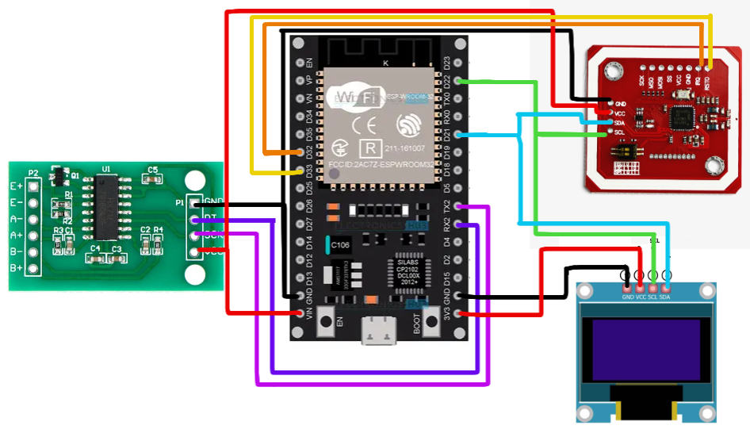
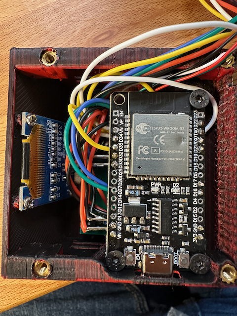
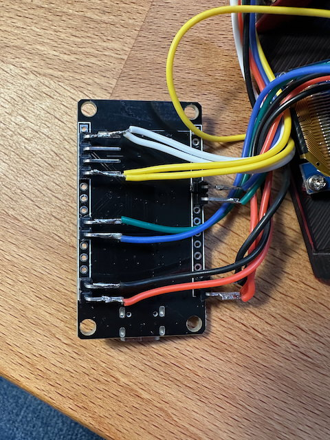

# FilaMan - Filament Management System (Erweiterte Fork)

[English Version](README.md)

> **Hinweis:** Dies ist eine erweiterte Fork von [ManuelW77/Filaman](https://github.com/ManuelW77/Filaman) mit zusätzlichen Features für mehrfarbige Filamente, Anycubic ACE Pro NFC Tag Unterstützung und erweiterte Weboberflächen-Funktionen.

FilaMan ist ein Filament-Managementsystem für den 3D-Druck. Es verwendet ESP32-Hardware für Gewichtsmessungen und NFC-Tag-Management.
Benutzer können Filamentspulen verwalten, den Status des Automatic Material System (AMS) von Bambulab Druckern überwachen und Einstellungen über eine Weboberfläche vornehmen.
Das System integriert sich nahtlos mit der [Spoolman](https://github.com/Donkie/Spoolman) Filamentverwaltung, zusätzlich mit [Bambulab](https://bambulab.com/en-us) 3D-Druckern und sowie dem [Openspool](https://github.com/spuder/OpenSpool) NFC-TAG Format.



Weitere Bilder finden Sie im [img Ordner](/img/)
Original Website: [FilaMan Website](https://www.filaman.app)
Deutsches Erklärvideo: [Youtube](https://youtu.be/uNDe2wh9SS8?si=b-jYx4I1w62zaOHU)
Discord Server: [https://discord.gg/my7Gvaxj2v](https://discord.gg/my7Gvaxj2v)

---

## ✨ Erweiterte Features in dieser Fork

Diese Fork fügt dem Original-FilaMan-Projekt mehrere leistungsstarke Erweiterungen hinzu:

### 🎨 Mehrfarbige Filament-Unterstützung
- **Multi-Color Display:** Visuelle Darstellung mehrfarbiger Filamente in der Weboberfläche
- **Erweiterte Farbvalidierung:** Unterstützung für RGB und RGBA Farbformate mit detaillierter Validierung
- **Große Farbanzeige:** Verbessertes 2-Spalten-Layout mit prominenter Farbdarstellung
- **Erweiterte NDEF-Unterstützung:** Verarbeitet große Datenmengen (>255 Bytes) für komplexe Filamentdaten

### 🏷️ Anycubic ACE Pro NFC Tag Unterstützung
- **ACE Pro Tag-Beschreibung:** Schreiben von NFC-Tags kompatibel mit Anycubic ACE Pro Druckern
- **Hybrid-Format:** Unterstützt sowohl FilaMan JSON-Format als auch ACE Pro Binär-Format
- **Automatische SKU-Generierung:** Erstellt eindeutige Identifikatoren für jede Spule
- **Erweiterte Brand/Material-Felder:** Unterstützung für vollständige Markennamen und Materialbezeichnungen
- **Farbformat-Konvertierung:** Automatische Konvertierung zwischen RGB und ABGR Formaten

### 📊 Erweiterte Weboberfläche
- **Bett-Temperatur-Anzeige:** Zeigt Bett-Temperatureinstellungen für jedes Filament
- **Temperatur-Bereiche:** Anzeige von Düsen- und Bett-Temperaturbereichen
- **SKU-Information:** Zeigt eindeutige Spulen-Identifikatoren
- **Verbesserte NFC-Karten-Layout:** Besser organisierte Filament-Informationsanzeige
- **Echtzeit-Cache-Updates:** Verbesserter JavaScript-Reload-Mechanismus

### ⚖️ Verbesserte Waagen-Funktionalität
- **Erweiterte Kalibrierungszeit:** 10-Sekunden-Kalibrierungsfenster für präzisere Gewichtseinstellung
- **Besseres Benutzer-Feedback:** Verbesserte Kalibrierungsprozess mit klareren Anweisungen

### 🔌 Erweiterte API-Integration
- **Multi-Color API-Unterstützung:** Extrahiert und zeigt mehrfarbige Hex-Werte aus Spoolman
- **Temperaturfeld-Extraktion:** Korrekte Extraktion von Düsen- und Bett-Temperatureinstellungen
- **Fallback-Matching:** Intelligentes Brand- und Material-Matching mit Fallback-Unterstützung
- **Rückwärtskompatibilität:** Behält Kompatibilität mit bestehenden Spoolman-Installationen

---

## NEU: Recycling Fabrik

<a href="https://www.recyclingfabrik.com" target="_blank">
    
</a>

FilaMan wird von [Recycling Fabrik](https://www.recyclingfabrik.com) unterstützt.
Recycling Fabrik wird demnächst auf seinen Spulen einen FilaMan tauglichen NFC Tag anbieten. Das hat den Vorteil,
dass die Spulen direkt über FilaMan, ganz automatisch, erkannt und in Spoolman importiert werden können.

**Was ist Recycling Fabrik?**

Die Recycling Fabrik ist ein deutsches Unternehmen, das sich der Entwicklung und Herstellung von nachhaltigem 3D-Druck-Filament verschrieben hat.
Ihre Filamente bestehen zu 100 % aus recyceltem Material, welches sowohl vom Endkunden, als auch aus der Industrie stammt – für eine umweltbewusste und ressourcenschonende Zukunft.

Mehr Informationen und Produkte findest du hier: [www.recyclingfabrik.com](https://www.recyclingfabrik.com)

---

### Für detaillierte Informationen zum Original-FilaMan: [Wiki](https://github.com/ManuelW77/Filaman/wiki)

### ESP32 Hardware-Funktionen
- **Gewichtsmessung:** Verwendung einer Wägezelle mit HX711-Verstärker für präzise Gewichtsverfolgung.
- **NFC-Tag Lesen/Schreiben:** PN532-Modul zum Lesen und Schreiben von Filamentdaten auf NFC-Tags.
- **OLED-Display:** Zeigt aktuelles Gewicht, Verbindungsstatus (WiFi, Bambu Lab, Spoolman).
- **WLAN-Konnektivität:** WiFiManager für einfache Netzwerkkonfiguration.
- **MQTT-Integration:** Verbindet sich mit Bambu Lab Drucker für AMS-Steuerung.
- **NFC-Tag NTAG213 NTAG215:** Verwendung von NTAG213, besser NTAG215 wegen ausreichendem Speicherplatz auf dem Tag

### Weboberflächen-Funktionen
- **Echtzeit-Updates:** WebSocket-Verbindung für Live-Daten-Updates.
- **NFC-Tag-Verwaltung:**
	- Filamentdaten auf NFC-Tags schreiben
	- Unterstützung für mehrere NFC-Tag-Formate:
		- [Openspool](https://github.com/spuder/OpenSpool) Format für Bambu Lab AMS
		- Anycubic ACE Pro Binär-Format
	- Automatische Spulenerkennung im AMS
	- **Hersteller Tag Unterstützung:** Automatische Erstellung von Spoolman-Einträgen aus Hersteller NFC-Tags
- **Erweiterte Filament-Anzeige:**
	- Mehrfarbige Filament-Visualisierung
	- Bett- und Düsen-Temperaturbereiche
	- SKU und Material-Informationen
	- Große Farbvorschau
- **Bambulab AMS-Integration:**
  - Anzeige der aktuellen AMS-Fachbelegung
  - Zuordnung von Filamenten zu AMS-Slots
  - Unterstützung für externe Spulenhalter
- **Spoolman-Integration:**
  - Auflistung verfügbarer Filamentspulen
  - Filtern und Auswählen von Filamenten
  - Automatische Aktualisierung der Spulengewichte
  - Verfolgung von NFC-Tag-Zuweisungen
  - Mehrfarbige Filament-Unterstützung
  - Unterstützt das Spoolman Octoprint Plugin

### Wenn Sie die Arbeit des Original-Erstellers unterstützen möchten:

<a href="https://www.buymeacoffee.com/manuelw" target="_blank"></a>

## Hersteller Tags Unterstützung

🎉 **Aufregende Neuigkeiten!** FilaMan unterstützt jetzt **Hersteller Tags** - NFC-Tags, die direkt von Filament-Herstellern vorprogrammiert geliefert werden!

### Erster Hersteller-Partner: RecyclingFabrik

Wir freuen uns anzukündigen, dass [**RecyclingFabrik**](https://www.recyclingfabrik.de) der **erste Filament-Hersteller** sein wird, der FilaMan unterstützt, indem sie NFC-Tags im FilaMan-Format auf ihren Spulen anbieten!

**Demnächst verfügbar:** RecyclingFabrik-Spulen werden NFC-Tags enthalten, die sich automatisch in Ihr FilaMan-System integrieren, manuelle Einrichtung überflüssig machen und perfekte Kompatibilität gewährleisten.

### Wie Hersteller Tags funktionieren

Wenn Sie zum ersten Mal einen Hersteller NFC-Tag scannen:
1. **Automatische Markenerkennung:** FilaMan erkennt den Hersteller und erstellt die Marke in Spoolman
2. **Filament-Typ Erstellung:** Alle Materialspezifikationen werden automatisch hinzugefügt
3. **Spulen-Registrierung:** Ihre spezifische Spule wird mit korrektem Gewicht und Spezifikationen registriert
4. **Zukünftige Schnellerkennung:** Nachfolgende Scans verwenden Fast-Path-Erkennung für sofortige Gewichtsmessung

### Vorteile für Benutzer
- ✅ **Null manuelle Einrichtung** - Einfach scannen und wiegen
- ✅ **Perfekte Datengenauigkeit** - Hersteller-verifizierte Spezifikationen
- ✅ **Sofortige Integration** - Nahtlose Spoolman-Kompatibilität
- ✅ **Zukunftssicher** - Tags funktionieren mit jedem FilaMan-kompatiblen System

## Detaillierte Funktionalität

### ESP32-Funktionalität
- **Druckaufträge steuern und überwachen:** Der ESP32 kommuniziert mit dem Bambu Lab Drucker.
- **Drucker-Kommunikation:** Nutzt MQTT für Echtzeit-Kommunikation mit dem Drucker.
- **Benutzerinteraktionen:** Das OLED-Display bietet sofortiges Feedback zum Systemstatus.
- **Verbesserte Kalibrierung:** Erweiterte Kalibrierungszeit für präzisere Gewichtsmessungen.

### Weboberflächen-Funktionalität
- **Benutzerinteraktionen:** Die Weboberfläche ermöglicht Benutzern die Interaktion mit dem System.
- **Erweiterte UI-Elemente:**
	- Dropdown-Menüs für Hersteller und Filamente
	- Buttons zum Beschreiben von NFC-Tags in mehreren Formaten
	- Echtzeit-Statusanzeigen
	- Mehrfarbige Filament-Visualisierung
	- Temperaturbereich-Anzeigen
	- SKU-Informations-Panels

## Hardware-Anforderungen

### Komponenten (Affiliate Links)
- **ESP32 Development Board:** Beliebige ESP32 Variante.
[Amazon Link](https://amzn.to/3FHea6D)
- **HX711 5kg Wägezellen Verstärker:** Für Gewichtsmessung.
[Amazon Link](https://amzn.to/4ja1KTe)
- **OLED 0.96 Zoll I2C weiß/gelb Display:** 128x64 SSD1306.
[Amazon Link](https://amzn.to/445aaa9)
- **PN532 NFC NXP RFID-Modul V3:** Für NFC Tag Operationen.
[Amazon Link](https://amzn.eu/d/gy9vaBX)
- **NFC Tags NTAG213 NTAG215:** RFID Tag
[Amazon Link](https://amzn.to/3E071xO)
- **TTP223 Touch Sensor (optional):** Für Re-TARE per Button/Touch
[Amazon Link](https://amzn.to/4hTChMK)


### Pin Konfiguration
| Component          | ESP32 Pin |
|-------------------|-----------|
| HX711 DOUT        | 16        |
| HX711 SCK         | 17        |
| OLED SDA          | 21        |
| OLED SCL          | 22        |
| PN532 IRQ         | 32        |
| PN532 RESET       | 33        |
| PN532 SDA         | 21        |
| PN532 SCL         | 22        |
| TTP223 I/O        | 25        |

**!! Achte darauf, dass am PN532 die DIP-Schalter auf I2C gestellt sind**
**Nutze den 3V Pin vom ESP für den Touch Sensor**






*Die Wägezelle wird bei den meisten HX711 Modulen folgendermaßen verkabelt:
E+ rot
E- schwarz
A- weiß
A+ grün*

## Software-Abhängigkeiten

### ESP32-Bibliotheken
- `WiFiManager`: Netzwerkkonfiguration
- `ESPAsyncWebServer`: Webserver-Funktionalität
- `ArduinoJson`: JSON-Verarbeitung
- `PubSubClient`: MQTT-Kommunikation
- `Adafruit_PN532`: NFC-Funktionalität
- `Adafruit_SSD1306`: OLED-Display-Steuerung
- `HX711`: Wägezellen-Kommunikation

## Installation

### Voraussetzungen
- **Software:**
  - [VS Code](https://code.visualstudio.com/)
  - [PlatformIO Extension](https://platformio.org/install/ide?install=vscode) für VS Code
  - [Spoolman](https://github.com/Donkie/Spoolman) Instanz
- **Hardware:**
  - ESP32 Entwicklungsboard
  - HX711 Wägezellen-Verstärker
  - Wägezelle (Gewichtssensor)
  - OLED Display (128x64 SSD1306)
  - PN532 NFC Modul
  - Verbindungskabel

### Wichtiger Hinweis zu Spoolman
Du musst Spoolman im DEBUG-Modus betreiben, da man bisher in Spoolman keine CORS Domains setzen kann:

```
# Enable debug mode
# If enabled, the client will accept requests from any host
# This can be useful when developing, but is also a security risk
# Default: FALSE
SPOOLMAN_DEBUG_MODE=TRUE
```

### Schritt-für-Schritt Installation

1. **VS Code und PlatformIO installieren:**
   - Lade [VS Code](https://code.visualstudio.com/) herunter und installiere es
   - Öffne VS Code und installiere die [PlatformIO Extension](https://platformio.org/install/ide?install=vscode)

2. **Repository klonen:**
   ```bash
   git clone https://github.com/Anzarion/Filaman.git
   cd Filaman
   ```

3. **Projekt in VS Code öffnen:**
   - Öffne VS Code
   - Klicke auf "File" → "Open Folder"
   - Wähle den geklonten `Filaman` Ordner

4. **Abhängigkeiten installieren:**
   - PlatformIO installiert die Abhängigkeiten automatisch beim ersten Öffnen
   - Alternativ: Öffne das PlatformIO Terminal und führe aus:
     ```bash
     pio lib install
     ```

5. **ESP32 anschließen und flashen:**
   - Schließe deinen ESP32 per USB an
   - In VS Code: Klicke auf das PlatformIO Icon in der Seitenleiste
   - Klicke auf "Upload" unter PROJECT TASKS → env:esp32dev

6. **Ersteinrichtung:**
   - Nach dem Flashen erstellt der ESP32 ein WiFi-Netzwerk namens "FilaMan"
   - Verbinde dich mit diesem Netzwerk
   - Konfiguriere deine WiFi-Einstellungen über das Captive Portal
   - Nach der Verbindung ist die Weboberfläche unter `http://filaman.local` oder der IP-Adresse erreichbar

## Dokumentation

### Relevante Links
- [Original FilaMan Repository](https://github.com/ManuelW77/Filaman)
- [PlatformIO Dokumentation](https://docs.platformio.org/)
- [Spoolman Dokumentation](https://github.com/Donkie/Spoolman)
- [Bambu Lab Drucker Dokumentation](https://www.bambulab.com/)

### Tutorials und Beispiele
- [PlatformIO erste Schritte](https://docs.platformio.org/en/latest/tutorials/espressif32/arduino_debugging_unit_testing.html)
- [ESP32 Webserver Tutorial](https://randomnerdtutorials.com/esp32-web-server-arduino-ide/)

## Lizenz

Dieses Projekt ist unter der MIT-Lizenz lizenziert. Siehe [LICENSE](LICENSE) Datei für Details.

## Materialien

### Nützliche Ressourcen
- [ESP32 Offizielle Dokumentation](https://docs.espressif.com/projects/esp-idf/en/latest/esp32/)
- [Arduino Bibliotheken](https://www.arduino.cc/en/Reference/Libraries)
- [NFC Tag Informationen](https://learn.adafruit.com/adafruit-pn532-rfid-nfc/overview)

### Community und Support
- [PlatformIO Community](https://community.platformio.org/)
- [Arduino Forum](https://forum.arduino.cc/)
- [ESP32 Forum](https://www.esp32.com/)
- [Original FilaMan Discord Server](https://discord.gg/my7Gvaxj2v)

## Verfügbarkeit

**Original FilaMan:** Der Original-Code kann vom [offiziellen Repository](https://github.com/ManuelW77/Filaman) heruntergeladen werden.

**Diese Erweiterte Fork:** Verfügbar unter [https://github.com/Anzarion/Filaman](https://github.com/Anzarion/Filaman)

---

## Credits

- **Original FilaMan:** Erstellt von [ManuelW77](https://github.com/ManuelW77)
- **Erweiterte Fork:** Gepflegt von [Anzarion](https://github.com/Anzarion)

### Unterstütze den Original-Ersteller

Wenn du Manuels großartige Arbeit am Original-FilaMan-Projekt unterstützen möchtest:

<a href="https://www.buymeacoffee.com/manuelw" target="_blank"></a>
