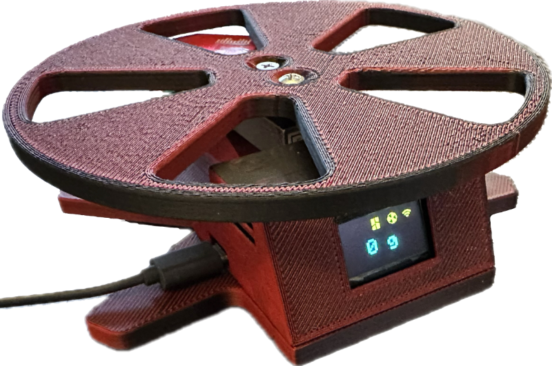

# FilaMan - Filament Management System

FilaMan ist ein Filament-Managementsystem für den 3D-Druck. Es verwendet ESP32-Hardware für Gewichtsmessungen und NFC-Tag-Management. 
Benutzer können Filamentspulen verwalten, den Status des Automatic Material System (AMS) von Bablulab Druckern überwachen und Einstellungen über eine Weboberfläche vornehmen. 
Das System integriert sich nahtlos mit der [Spoolman](https://github.com/Donkie/Spoolman) Filamentverwaltung, zusätzlich mit [Bambulab](https://bambulab.com/en-us) 3D-Druckern und sowie dem [Openspool](https://github.com/spuder/OpenSpool) NFC-TAG Format.



Weitere Bilder finden Sie im [img Ordner](/img/)  
oder auf meiner Website: [FilaMan Website](https://www.filaman.app)  
Deutsches Erklärvideo: [Youtube](https://youtu.be/uNDe2wh9SS8?si=b-jYx4I1w62zaOHU)

### ESP32 Hardware-Funktionen
- **Gewichtsmessung:** Verwendung einer Wägezelle mit HX711-Verstärker für präzise Gewichtsverfolgung.
- **NFC-Tag Lesen/Schreiben:** PN532-Modul zum Lesen und Schreiben von Filamentdaten auf NFC-Tags.
- **OLED-Display:** Zeigt aktuelles Gewicht, Verbindungsstatus (WiFi, Bambu Lab, Spoolman).
- **WLAN-Konnektivität:** WiFiManager für einfache Netzwerkkonfiguration.
- **MQTT-Integration:** Verbindet sich mit Bambu Lab Drucker für AMS-Steuerung.
- **NFC-Tag NTAG215:** Verwendung von NTAG215 wegen ausreichendem Speicherplatz auf dem Tag

### Weboberflächen-Funktionen
- **Echtzeit-Updates:** WebSocket-Verbindung für Live-Daten-Updates.
- **NFC-Tag-Verwaltung:** 
    - Filamentdaten auf NFC-Tags schreiben.
    - Verwendet das NFC-Tag-Format von [Openspool](https://github.com/spuder/OpenSpool)
    - Ermöglicht automatische Spulenerkennung im AMS
- **Bambulab AMS-Integration:** 
  - Anzeige der aktuellen AMS-Fachbelegung.
  - Zuordnung von Filamenten zu AMS-Slots.
  - Unterstützung für externe Spulenhalter.
- **Spoolman-Integration:**
  - Auflistung verfügbarer Filamentspulen.
  - Filtern und Auswählen von Filamenten.
  - Automatische Aktualisierung der Spulengewichte.
  - Verfolgung von NFC-Tag-Zuweisungen.

### Wenn Sie meine Arbeit unterstützen möchten, freue ich mich über einen Kaffee
<a href="https://www.buymeacoffee.com/manuelw" target="_blank"></a>

## Detaillierte Funktionalität

### ESP32-Funktionalität
- **Druckaufträge steuern und überwachen:** Der ESP32 kommuniziert mit dem Bambu Lab Drucker.
- **Drucker-Kommunikation:** Nutzt MQTT für Echtzeit-Kommunikation mit dem Drucker.
- **Benutzerinteraktionen:** Das OLED-Display bietet sofortiges Feedback zum Systemstatus.

### Weboberflächen-Funktionalität
- **Benutzerinteraktionen:** Die Weboberfläche ermöglicht Benutzern die Interaktion mit dem System.
- **UI-Elemente:** Enthält Dropdown-Menüs für Hersteller und Filamente, Buttons zum Beschreiben von NFC-Tags und Echtzeit-Statusanzeigen.

## Hardware-Anforderungen

### Komponenten
- **ESP32 Entwicklungsboard:** Jede ESP32-Variante.
[Amazon Link](https://amzn.eu/d/aXThslf)
- **HX711 5kg Wägezellen-Verstärker:** Für Gewichtsmessung.
[Amazon Link](https://amzn.eu/d/06A0DLb)
- **OLED 0.96 Zoll I2C weiß/gelb Display:** 128x64 SSD1306.
[Amazon Link](https://amzn.eu/d/0AuBp2c)
- **PN532 NFC NXP RFID-Modul V3:** Für NFC-Tag-Operationen.
[Amazon Link](https://amzn.eu/d/jfIuQXb)
- **NFC Tags Ntag215:** RFID Tag
[Amazon Link](https://amzn.eu/d/9Z6mXc1)

### Pin-Konfiguration
| Komponente        | ESP32 Pin |
|-------------------|-----------|
| HX711 DOUT        | 16        |
| HX711 SCK         | 17        |
| OLED SDA          | 21        |
| OLED SCL          | 22        |
| PN532 IRQ         | 32        |
| PN532 RESET       | 33        |
| PN532 SDA         | 21        |
| PN532 SCL         | 22        |

**Achte darauf, dass am PN532 die DIP-Schalter auf I2C gestellt sind**


## Software-Abhängigkeiten

### ESP32-Bibliotheken
- `WiFiManager`: Netzwerkkonfiguration
- `ESPAsyncWebServer`: Webserver-Funktionalität
- `ArduinoJson`: JSON-Verarbeitung
- `PubSubClient`: MQTT-Kommunikation
- `Adafruit_PN532`: NFC-Funktionalität
- `Adafruit_SSD1306`: OLED-Display-Steuerung
- `HX711`: Wägezellen-Kommunikation

## Installation

### Voraussetzungen
- **Software:**
  - [PlatformIO](https://platformio.org/) in VS Code
  - [Spoolman](https://github.com/Donkie/Spoolman) Instanz
- **Hardware:**
  - ESP32 Entwicklungsboard
  - HX711 Wägezellen-Verstärker
  - Wägezelle (Gewichtssensor)
  - OLED Display (128x64 SSD1306)
  - PN532 NFC Modul
  - Verbindungskabel

## Wichtiger Hinweis
Du musst Spoolman auf DEBUG Modus setzten, da man bisher in Spoolman keine CORS Domains setzen kann!

```
# Enable debug mode
# If enabled, the client will accept requests from any host
# This can be useful when developing, but is also a security risk
# Default: FALSE
#SPOOLMAN_DEBUG_MODE=TRUE
```

## Schritt-für-Schritt Installation
### Einfache Installation
1. **Gehe auf [FilaMan Installer](https://www.filaman.app/installer.html)**

2. **Stecke dein ESP an den Rechner und klicke Connect**

3. **Wähle dein Device Port und klicke Intall**

4. **Ersteinrichtung:**
    - Mit dem "FilaMan" WLAN-Zugangspunkt verbinden.
    - WLAN-Einstellungen über das Konfigurationsportal vornehmen.
    - Weboberfläche unter `http://filaman.local` oder der IP-Adresse aufrufen.

### Compile by yourself
1. **Repository klonen:**
    ```bash
    git clone https://github.com/ManuelW77/Filaman.git
    cd FilaMan
    ```
2. **Abhängigkeiten installieren:**
    ```bash
    pio lib install
    ```
3. **ESP32 flashen:**
    ```bash
    pio run --target upload
    ```
4. **Ersteinrichtung:**
    - Mit dem "FilaMan" WLAN-Zugangspunkt verbinden.
    - WLAN-Einstellungen über das Konfigurationsportal vornehmen.
    - Weboberfläche unter `http://filaman.local` oder der IP-Adresse aufrufen.

## Dokumentation

### Relevante Links
- [PlatformIO Dokumentation](https://docs.platformio.org/)
- [Spoolman Dokumentation](https://github.com/Donkie/Spoolman)
- [Bambu Lab Drucker Dokumentation](https://www.bambulab.com/)

### Tutorials und Beispiele
- [PlatformIO erste Schritte](https://docs.platformio.org/en/latest/tutorials/espressif32/arduino_debugging_unit_testing.html)
- [ESP32 Webserver Tutorial](https://randomnerdtutorials.com/esp32-web-server-arduino-ide/)

## Lizenz

Dieses Projekt ist unter der MIT-Lizenz lizenziert. Siehe [LICENSE](LICENSE) Datei für Details.

## Materialien

### Nützliche Ressourcen
- [ESP32 Offizielle Dokumentation](https://docs.espressif.com/projects/esp-idf/en/latest/esp32/)
- [Arduino Bibliotheken](https://www.arduino.cc/en/Reference/Libraries)
- [NFC Tag Informationen](https://learn.adafruit.com/adafruit-pn532-rfid-nfc/overview)

### Community und Support
- [PlatformIO Community](https://community.platformio.org/)
- [Arduino Forum](https://forum.arduino.cc/)
- [ESP32 Forum](https://www.esp32.com/)

## Verfügbarkeit

Der Code kann getestet und die Anwendung kann vom [GitHub Repository](https://github.com/ManuelW77/Filaman) heruntergeladen werden.

### Wenn Sie meine Arbeit unterstützen möchten, freue ich mich über einen Kaffee
<a href="https://www.buymeacoffee.com/manuelw" target="_blank"></a>