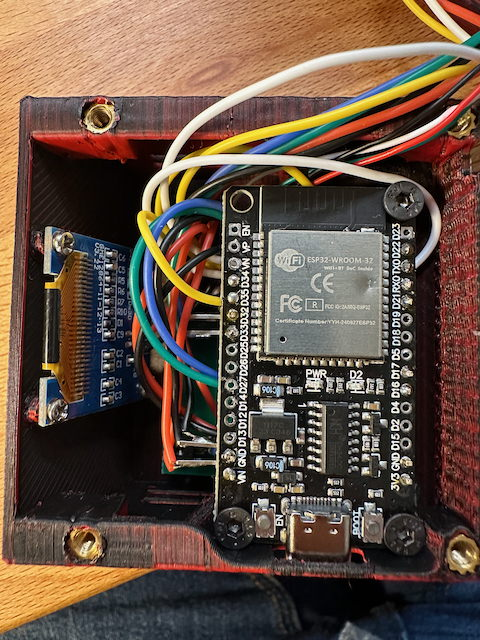

# FilaMan - Filament Management System

[Deutsche Version](README.de.md)

FilaMan is a filament management system for 3D printing. It uses ESP32 hardware for weight measurement and NFC tag management. 
Users can manage filament spools, monitor the status of the Automatic Material System (AMS) and make settings via a web interface. 
The system integrates seamlessly with [Bambulab](https://bambulab.com/en-us) 3D printers and [Spoolman](https://github.com/Donkie/Spoolman) filament management as well as the [Openspool](https://github.com/spuder/OpenSpool) NFC-TAG format.


More Images can be found in the [img Folder](/img/)  
or my website: [FilaMan Website](https://www.filaman.app)  
german explanatory video: [Youtube](https://youtu.be/uNDe2wh9SS8?si=b-jYx4I1w62zaOHU)  
Discord Server: [https://discord.gg/my7Gvaxj2v](https://discord.gg/my7Gvaxj2v)

### Now more detailed informations about the usage: [Wiki](https://github.com/ManuelW77/Filaman/wiki)

### ESP32 Hardware Features
- **Weight Measurement:** Using a load cell with HX711 amplifier for precise weight tracking.
- **NFC Tag Reading/Writing:** PN532 module for reading and writing filament data to NFC tags.
- **OLED Display:** Shows current weight, connection status (WiFi, Bambu Lab, Spoolman).
- **WiFi Connectivity:** WiFiManager for easy network configuration.
- **MQTT Integration:** Connects to Bambu Lab printer for AMS control.
- **NFC-Tag NTAG213 NTAG215:** Use NTAG213, better NTAG215 because of enaught space on the Tag

### Web Interface Features
- **Real-time Updates:** WebSocket connection for live data updates.
- **NFC Tag Management:** 
	- Write filament data to NFC tags.
	- uses NFC-Tag Format of [Openspool](https://github.com/spuder/OpenSpool)
	- so you can use it with automatic Spool detection in AMS
- **Bambulab AMS Integration:** 
  - Display current AMS tray contents.
  - Assign filaments to AMS slots.
  - Support for external spool holder.
- **Spoolman Integration:**
  - List available filament spools.
  - Filter and select filaments.
  - Update spool weights automatically.
  - Track NFC tag assignments.
  - Supports Spoolman Octoprint Plugin

### If you want to support my work, i would be happy to get a coffe
<a href="https://www.buymeacoffee.com/manuelw" target="_blank"></a>

## Detailed Functionality

### ESP32 Functionality
- **Control and Monitor Print Jobs:** The ESP32 communicates with the Bambu Lab printer to control and monitor print jobs.
- **Printer Communication:** Uses MQTT for real-time communication with the printer.
- **User Interactions:** The OLED display provides immediate feedback on the system status, including weight measurements and connection status.

### Web Interface Functionality
- **User Interactions:** The web interface allows users to interact with the system, select filaments, write NFC tags, and monitor AMS status.
- **UI Elements:** Includes dropdowns for selecting manufacturers and filaments, buttons for writing NFC tags, and real-time status indicators.

## Hardware Requirements

### Components
- **ESP32 Development Board:** Any ESP32 variant.
[Amazon Link](https://amzn.to/3FHea6D)
- **HX711 5kg Load Cell Amplifier:** For weight measurement.
[Amazon Link](https://amzn.to/4ja1KTe)
- **OLED 0.96 Zoll I2C white/yellow Display:** 128x64 SSD1306.
[Amazon Link](https://amzn.to/445aaa9)
- **PN532 NFC NXP RFID-Modul V3:** For NFC tag operations.
[Amazon Link](https://amzn.to/4iO6CO4)
- **NFC Tags NTAG213 NTAG215:** RFID Tag
[Amazon Link](https://amzn.to/3E071xO)
- **TTP223 Touch Sensor (optional):** For reTARE per Button/Touch
[Amazon Link](https://amzn.to/4hTChMK)


### Pin Configuration
| Component          | ESP32 Pin |
|-------------------|-----------|
| HX711 DOUT        | 16        |
| HX711 SCK         | 17        |
| OLED SDA          | 21        |
| OLED SCL          | 22        |
| PN532 IRQ         | 32        |
| PN532 RESET       | 33        |
| PN532 SDA         | 21        |
| PN532 SCL         | 22        |
| TTP223 I/O        | 25        |

**!! Make sure that the DIP switches on the PN532 are set to I2C**
**Use the 3V pin from the ESP for the touch sensor**





## Software Dependencies

### ESP32 Libraries
- `WiFiManager`: Network configuration
- `ESPAsyncWebServer`: Web server functionality
- `ArduinoJson`: JSON parsing and creation
- `PubSubClient`: MQTT communication
- `Adafruit_PN532`: NFC functionality
- `Adafruit_SSD1306`: OLED display control
- `HX711`: Load cell communication

### Installation

## Prerequisites
- **Software:**
  - [PlatformIO](https://platformio.org/) in VS Code
  - [Spoolman](https://github.com/Donkie/Spoolman) instance
- **Hardware:**
  - ESP32 Development Board
  - HX711 Load Cell Amplifier
  - Load Cell (weight sensor)
  - OLED Display (128x64 SSD1306)
  - PN532 NFC Module
  - Connecting wires

## Important Note
You have to activate Spoolman in debug mode, because you are not able to set CORS Domains in Spoolman yet.

```
# Enable debug mode
# If enabled, the client will accept requests from any host
# This can be useful when developing, but is also a security risk
# Default: FALSE
#SPOOLMAN_DEBUG_MODE=TRUE
```


## Step-by-Step Installation
### Easy Installation
1. **Go to [FilaMan Installer](https://www.filaman.app/installer.html)**

2. **Plug you device in and push Connect button**

3. **Select your Device Port and push Intall**

4. **Initial Setup:**
    - Connect to the "FilaMan" WiFi access point.
    - Configure WiFi settings through the captive portal.
    - Access the web interface at `http://filaman.local` or the IP address.

### Compile by yourself
1. **Clone the Repository:**
    ```bash
    git clone https://github.com/ManuelW77/Filaman.git
    cd FilaMan
    ```
2. **Install Dependencies:**
    ```bash
    pio lib install
    ```
3. **Flash the ESP32:**
    ```bash
    pio run --target upload
    ```
4. **Initial Setup:**
    - Connect to the "FilaMan" WiFi access point.
    - Configure WiFi settings through the captive portal.
    - Access the web interface at `http://filaman.local` or the IP address.

## Documentation

### Relevant Links
- [PlatformIO Documentation](https://docs.platformio.org/)
- [Spoolman Documentation](https://github.com/Donkie/Spoolman)
- [Bambu Lab Printer Documentation](https://www.bambulab.com/)

### Tutorials and Examples
- [PlatformIO Getting Started](https://docs.platformio.org/en/latest/tutorials/espressif32/arduino_debugging_unit_testing.html)
- [ESP32 Web Server Tutorial](https://randomnerdtutorials.com/esp32-web-server-arduino-ide/)

## License

This project is licensed under the MIT License. See the [LICENSE](LICENSE) file for details.

## Materials

### Useful Resources
- [ESP32 Official Documentation](https://docs.espressif.com/projects/esp-idf/en/latest/esp32/)
- [Arduino Libraries](https://www.arduino.cc/en/Reference/Libraries)
- [NFC Tag Information](https://learn.adafruit.com/adafruit-pn532-rfid-nfc/overview)

### Community and Support
- [PlatformIO Community](https://community.platformio.org/)
- [Arduino Forum](https://forum.arduino.cc/)
- [ESP32 Forum](https://www.esp32.com/)

## Availability

The code can be tested and the application can be downloaded from the [GitHub repository](https://github.com/ManuelW77/Filaman).

### If you want to support my work, i would be happy to get a coffe
<a href="https://www.buymeacoffee.com/manuelw" target="_blank"></a>